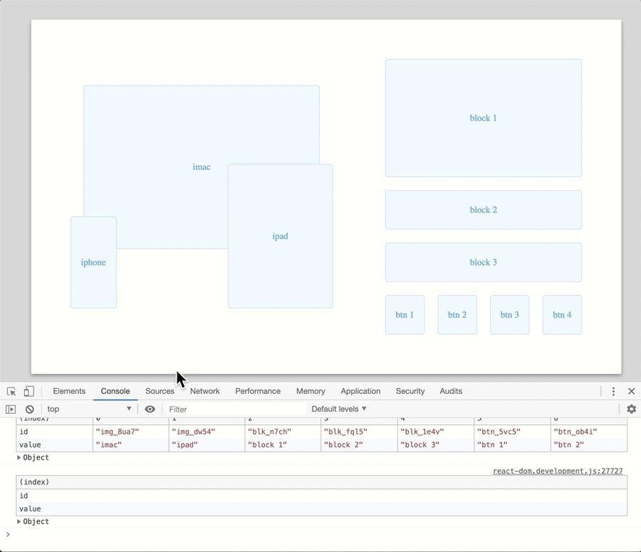

## Item Selection

实现 **元素选中** 功能

元素选中是创作型编辑器的一个常见功能

效果如 `feature-demo` 所示:

- **基本需求**
  - 用户可以用鼠标框选元素
  - 选取时显示选取范围
  - 给选中的元素添加显示效果
  - （选择结束后打印选中元素 id）

## 说明

基本代码已在 `src` 文件夹内，只需实现缺失的部分即可

代码量大约为 70 行  
预计耗时大约为 30~60 分钟  
使用你觉得趁手的任意前端工具实现（如 react/rxjs/ramda）

可自行扩充或缩减业务细节（如优化程度）
