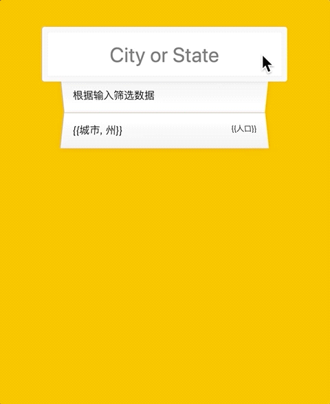

## Type Ahead

实现一个 **Type Ahead** 效果

Type Ahead 是一个提高用户体验的常见功能

效果如 `feature-demo` 所示:

- **基本需求**
  - 请求数据列表
  - 当数据准备完毕后，用户输入时需要进行数据筛选和展示
  - 数据展示效果如 demo 所示
  - （不用实现 autocomplete 和选择）

## 说明

基本代码已在 `src` 文件夹内，只需实现缺失的部分即可

代码量大约为 60 行  
预计耗时大约为 20~60 分钟  
使用你觉得趁手的任意前端工具实现（如 react/rxjs/ramda）

可自行扩充或缩减业务细节（如匹配或高亮算法的实现程度）
